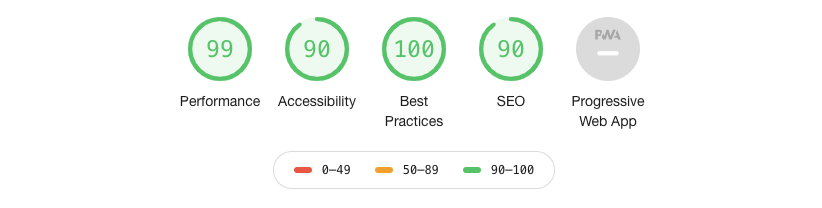

# Kamma code test

- see the hosted version here https://uttrasey.github.io/kamma/
- Opted for a really simple delivery of HTML/CSS served by Github pages
- I had the CSS in the HTML until I needed a second file
- design is pretty responsive and mobile friendly
- I've minified the deployed files for speed
- simple commit hook does the pre-processing of the files into the `/docs` folder which is then hosted by Github
- I had more of a debate around how to do the email/DB stage. There are services out there like Netflify and Firebase which are simpler than something like AWS. However I'm a big fan of the JAM Stack so opted for backend API delegating to a mailgun I had kicking around and storing the data in Dynamo. 
- Doing this properly I'd probably use Gatsby
- Secrets stored via SSM and injected by serverless
- I'm a firm believer in the benefits of few well written tests... in a more serious environment JEST would be included.
- The form is pretty basic, no validation, no feedback but I've spent enough time on this.

Picked up all the low hanging fruit on Lighthouse

